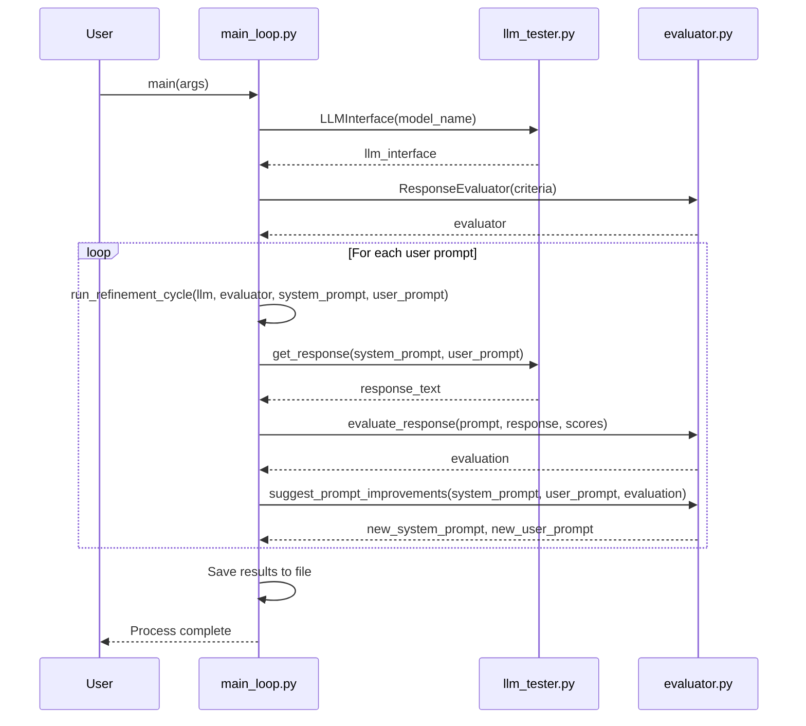

```mermaid
sequenceDiagram
    participant User
    participant main_loop.py
    participant llm_tester.py
    participant evaluator.py

    User->>main_loop.py: main(args)
    main_loop.py->>llm_tester.py: LLMInterface(model_name)
    llm_tester.py-->>main_loop.py: llm_interface
    main_loop.py->>evaluator.py: ResponseEvaluator(criteria)
    evaluator.py-->>main_loop.py: evaluator

    loop For each user prompt
        main_loop.py->>main_loop.py: run_refinement_cycle(llm, evaluator, system_prompt, user_prompt)
        main_loop.py->>llm_tester.py: get_response(system_prompt, user_prompt)
        llm_tester.py-->>main_loop.py: response_text
        main_loop.py->>evaluator.py: evaluate_response(prompt, response, scores)
        evaluator.py-->>main_loop.py: evaluation
        main_loop.py->>evaluator.py: suggest_prompt_improvements(system_prompt, user_prompt, evaluation)
        evaluator.py-->>main_loop.py: new_system_prompt, new_user_prompt
    end

    main_loop.py->>main_loop.py: Save results to file
    main_loop.py-->>User: Process complete
```
