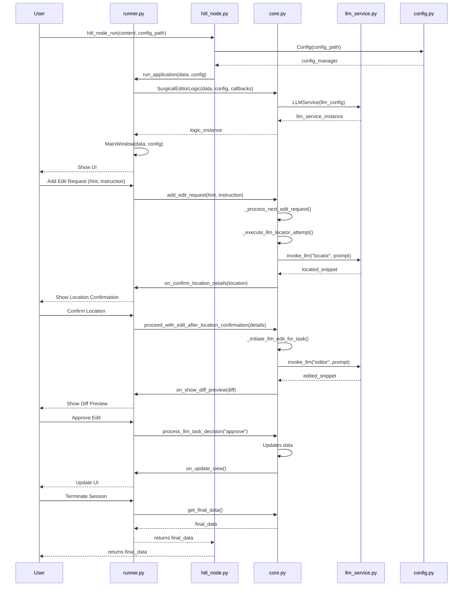

```mermaid
sequenceDiagram
    participant User
    participant runner.py
    participant hitl_node.py
    participant core.py
    participant llm_service.py
    participant config.py

    User->>hitl_node.py: hitl_node_run(content, config_path)
    hitl_node.py->>config.py: Config(config_path)
    config.py-->>hitl_node.py: config_manager
    hitl_node.py->>runner.py: run_application(data, config)
    runner.py->>core.py: SurgicalEditorLogic(data, config, callbacks)
    core.py->>llm_service.py: LLMService(llm_config)
    llm_service.py-->>core.py: llm_service_instance
    core.py-->>runner.py: logic_instance
    runner.py->>runner.py: MainWindow(data, config)
    runner.py-->>User: Show UI

    User->>runner.py: Add Edit Request (hint, instruction)
    runner.py->>core.py: add_edit_request(hint, instruction)
    core.py->>core.py: _process_next_edit_request()
    core.py->>core.py: _execute_llm_locator_attempt()
    core.py->>llm_service.py: invoke_llm("locator", prompt)
    llm_service.py-->>core.py: located_snippet
    core.py->>runner.py: on_confirm_location_details(location)
    runner.py-->>User: Show Location Confirmation

    User->>runner.py: Confirm Location
    runner.py->>core.py: proceed_with_edit_after_location_confirmation(details)
    core.py->>core.py: _initiate_llm_edit_for_task()
    core.py->>llm_service.py: invoke_llm("editor", prompt)
    llm_service.py-->>core.py: edited_snippet
    core.py->>runner.py: on_show_diff_preview(diff)
    runner.py-->>User: Show Diff Preview

    User->>runner.py: Approve Edit
    runner.py->>core.py: process_llm_task_decision("approve")
    core.py->>core.py: Updates data
    core.py->>runner.py: on_update_view()
    runner.py-->>User: Update UI

    User->>runner.py: Terminate Session
    runner.py->>core.py: get_final_data()
    core.py-->>runner.py: final_data
    runner.py-->>hitl_node.py: returns final_data
    hitl_node.py-->>User: returns final_data
```
